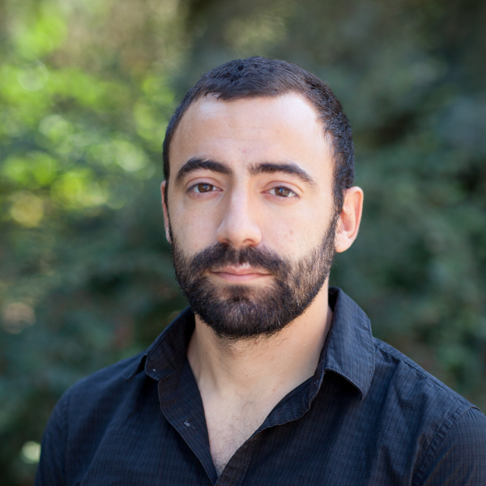

# Field matters
The first workshop on NLP applications to field linguistics.

## Important dates

 - TBA

## Workshop description

Field linguistics plays a crucial role in the development of linguistic theory and universal language modelling, as it provides uncontested, the only way to obtain structural data about the rapidly diminishing diversity of natural languages.

The Field matters workshop aims to bring together the urgent needs of field linguists and the vast community of NLP practitioners, developing up-to-date NLP tools for easier, faster, more reliable data collection and annotation.

## <a name="speakers"/>Invited speakers
### [Antonios Anastasopoulos](http://www.cs.cmu.edu/~aanastas/) (George Mason University)

Antonis Anastasopoulos is an assistant professor [at George Mason Computer Science Natural Language Processing Group](https://nlp.cs.gmu.edu/author/antonios-anastasopoulos/).
His interests include various aspects of multilingual Natural Language Processing and Machine Learning, with the main focus being Machine Translation and Speech Recognition
for endangered languages and low-resource settings in general.
He completed his Computer Science PhD at the University of Notre Dame, with a dissertation on "Computational Tools for Endangered Language Documentation".
He has been involved with documentation efforts on Griko, an endangered Greek dialect spoken in south Italy.
He co-organized the workshop on Language Technology for Language Documentation and Revitalization, hosted in Pittsburgh in August 2019.

## Program Committee
- Alexandre Arkhipov (University of Hamburg)
- Rolando Coto Solano (Dartmouth College)
- Emily Prud’hommeaux (Boston College)
- Robbie Jimmerson (Rochester Institute of Technology)
- Zoe Liu (Boston College)
- Harald Hammarström (Max Planck Institute forthe Science of Human History)
- David R. Mortensen (Carnegie Mellon University)
- Saliha Murado ̆glu (The Australian National University (ANU))
- Éric Le Ferrand (Charles Darwin University, Université Grenoble Alpes)
- He Zhou (Brigham Young University)
- Ezequiel Koile (HSE University, Max Planck Institute for the Science of Human History)
- Bonaveture Dossou (Jacobs University Bremen,Germany)
- Chris C. Emezue (Technical University Munich)
- William Lane (Charles Darwin University)
- John Mansfield (University of Melbourne)
- Vitaly Protasov (AIR Institute)
- Svetlana Toldova (HSE University)
## Organizers

**Oleg Serikov**
(HSE University, AIRI, MIPT,
[`oserikov@hse.ru`](mailto:oserikov@hse.ru))

is an NLP Researcher at AIR Institute. 
Oleg now writes his PhD thesis at HSE University, his main points of interest are under-resourced languages ASR, under-resourced languages modelling and linguistic interpretation of language models.
He co-organized SIGTYP 2021 and LowResourceEval 2021 shared tasks on under-resourced languages ASR.

**Elena Klyachko**
(Institute of Linguistics RAS, HSE University,
[`elenaklyachko@gmail.com`](mailto:elenaklyachko@gmail.com))

is a PhD student at HSE. Her main points of interest are Tungusic languages, which she has been studying during her fieldwork, as well as low-resource NLP.
She co-organized the SIGMORPHON 2020-2021 shared tasks on morphological reinflection, 
LowResourceEval 2019, 2021 shared tasks on NLP for field linguistic data and
SigTyp 2021 shared task on under-resourced languages ASR.

**Francis Tyers**
(Indiana University, HSE University,
[`ftyers@iu.edu`](mailto:ftyers@iu.edu))

has a huge experience with under-resourced languages processing. His reseach interests include modelling the grammar of polysyntetic languages, and application of finite-state methods to NLP. Francis is one of the core contributors of Apertium machine translation project \cite{forcada2011apertium}. He has an experience of co-organizing workshops and shared tasks, including SIGMORPHON 2020-2021, CoNLL 2018.

**Valentin Malykh**
(Huawei,
[`valentin.malykh@huawei.com`](mailto:valentin.malykh@huawei.com))

works as a senior research scientist at Huawei Noah's Ark laboratory. 
Dr Malykh has more than 20 papers in NLP field, including publications on such conferences as NeurIPS, ACL, WSDM.
Valentin previously co-organized the LoResMT 2018-2019 workshops; also he twice co-organized NeurIPS Challenge on Conversational Artificial Intelligence in 2017 and 2018.

**Timofey Arkhangelskiy**
(University of Hamburg,
[`timarkh@gmail.com`](mailto:timarkh@gmail.com))

is a researcher at the Institute for Finno-Ugric/Uralic Studies, where he is working on a language documentation project that involves linguistic fieldwork. His interests in NLP are morphology and application of existing tecniques to under-resourced languages to facilitate processing of fieldwork data. He has developed a number of general-purpose corpora of minority languages, as well as software for processing and publishing linguistic corpora.

**Tatiana Shavrina**
(AIRI, SberDevices, 
[`shavrina@airi.net`](mailto:shavrina@airi.net)) 

is a Research Project Manager in NLP at AIRI and the Chief Technology Expert in the Department of Experimental ML at SberDevices. Her research focus is on the evaluation of the language models.

**Ekaterina Vylomova**
(University of Melbourne,
[`evylomova@gmail.com`](mailto:evylomova@gmail.com)) 

is a Lecturer and a Postdoctoral Fellow at the University of Melbourne. Her research is focused on modelling of  morphology and computational approaches to linguistics typology. She is the president of SIGTYP, co-organized the SIGTYP 2019-2021 workshops and the SIGMORPHON 2017-2021 shared tasks on morphological reinflection. 

## Workshop programme 

TBD

## Paper submission 

## Dual submissions and preprints

## Camera-ready information

## Anti-Harassment Policy

## Demographic Diversity
